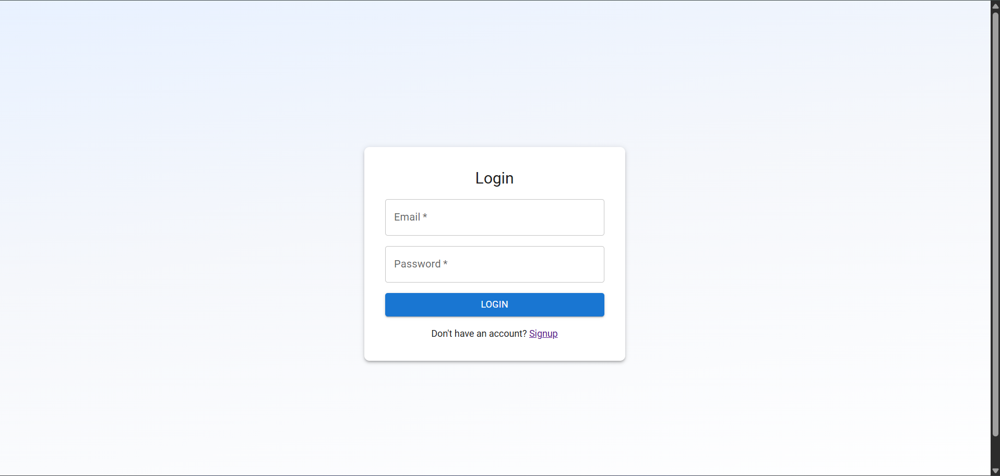
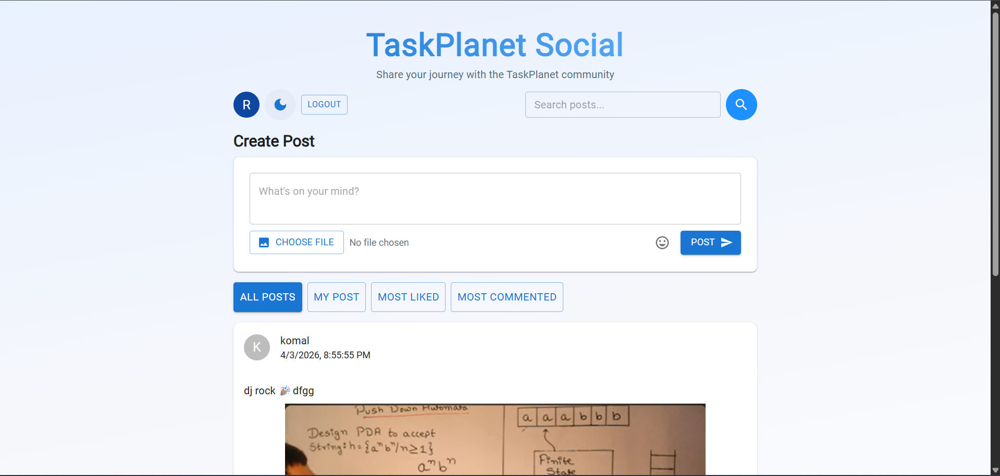
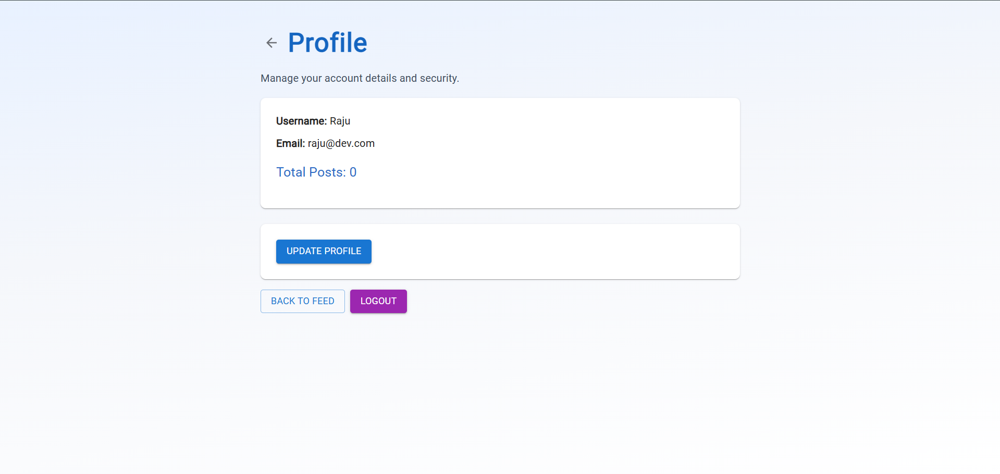

# 🚀 TaskPlanet Social
### Full-Stack Social Media Application

A **modern, responsive social media web application** built using the **MERN Stack (MongoDB, Express, React, Node.js)**.  
Users can create posts, upload images, like and comment on posts, search content, and manage their profiles with a clean UI.

This project demonstrates **full-stack development skills**, authentication systems, API design, and responsive UI development.

---

# 🌐 Live Demo

| Platform | Link |
|--------|------|
| Frontend (Vercel) | https://your-vercel-link.vercel.app |
| Backend API (Render) | https://your-render-link.onrender.com |


---

# 📸 Application Preview

>

### 🎯 Login-Page



### 🔐 Feed-Page



### 📊 Profile-Page



---

# ✨ Key Features

## 🔐 Authentication & User Management

- ✅ User **Signup with validation**
  - Username ≥ 3 characters
  - Valid email format
  - Password ≥ 6 characters

- ✅ **Secure Login System**
- ✅ **JWT Token Authentication**
- ✅ **Profile Page**
- ✅ **Profile Update (username/email/password)**
- ✅ **Password Reset Mode**
- ✅ **Secure token storage in localStorage**

---

# 📝 Social Features

- ✅ **Create Posts**
- ✅ **Upload Image with Post**
- ✅ **Edit Your Own Posts**
- ✅ **Delete Your Posts**
- ✅ **Like / Unlike Posts**
- ✅ **Comment on Posts**
- ✅ **View Comments with Username**

Ownership checks ensure that **only the creator of a post can edit or delete it**.

---

# 🔎 Feed & Discovery

The feed allows users to easily discover and filter posts.

### Feed Filters

- **All Posts** – View posts from all users  
- **My Posts** – Only your posts  
- **Most Liked** – Posts sorted by likes  
- **Most Commented** – Posts sorted by comments  

### Search

Users can search posts by:

- Username
- Post content

---

# 🎨 User Experience Features

- 🌙 **Dark Mode / Light Mode Toggle**
- 📱 **Fully Responsive Design**
- 🔔 **Toast-style success messages**
- ⚠️ **Clear error handling**
- ⏳ **Loading states**
- 🗑️ **Delete confirmation dialogs**
- 💾 **localStorage persistence**

---

# 📱 Responsive Design

The application is optimized for multiple screen sizes:

| Device | Width |
|------|------|
| Mobile | ≤600px |
| Tablet | 601-1024px |
| Desktop | ≥1025px |

Features include:

- Touch-friendly buttons
- Readable typography
- Adaptive layouts

---

# 🛠 Tech Stack

## Frontend

- **React 18**
- **React Router**
- **Material UI (MUI)**
- **Axios**
- **Vite**

---

## Backend

- **Node.js**
- **Express.js**
- **MongoDB**
- **Mongoose**
- **JWT Authentication**
- **bcryptjs (Password Hashing)**
- **Multer (Image Uploads)**
- **CORS**
- **dotenv**

---

# 🗂 Project Structure

```
social-post-app
│
├── backend
│   ├── models
│   │   ├── User.js
│   │   └── Post.js
│   │
│   ├── routes
│   │   ├── auth.js
│   │   └── posts.js
│   │
│   ├── middleware
│   │   └── auth.js
│   │
│   ├── uploads
│   │
│   ├── server.js
│   └── package.json
│
├── frontend
│   ├── src
│   │   ├── pages
│   │   │   ├── LoginPage.jsx
│   │   │   ├── SignupPage.jsx
│   │   │   ├── FeedPage.jsx
│   │   │   └── ProfilePage.jsx
│   │   │
│   │   ├── components
│   │   │   └── PostCard.jsx
│   │   │
│   │   ├── services
│   │   │   └── api.js
│   │   │
│   │   ├── App.jsx
│   │   └── main.jsx
│   │
│   └── package.json
│
└── README.md
```

---

# 🗄 Database

The application uses **MongoDB Atlas (Cloud Database)**.

### Collections

## Users Collection

```javascript
{
  username: String,
  email: String,
  password: String,
  createdAt: Date
}
```

---

## Posts Collection

```javascript
{
  userId: ObjectId,
  username: String,
  text: String,
  image: String,
  likes: [ObjectId],
  comments: [
    {
      userId: ObjectId,
      username: String,
      text: String,
      createdAt: Date
    }
  ],
  createdAt: Date
}
```

---

# 🔐 Security

- Passwords hashed using **bcryptjs**
- **JWT tokens** used for authentication
- **Protected API routes**
- **Authorization checks for post ownership**
- **CORS protection**
- **Input validation on both frontend and backend**

---

# ⚙️ Installation & Setup

## 1️⃣ Clone the Repository

```bash
git clone https://github.com/yourusername/taskplanet-social.git
cd taskplanet-social
```

---

# Backend Setup

```
cd backend
npm install
```

Create `.env`

```
MONGO_URI=your_mongodb_atlas_connection
JWT_SECRET=your_secret_key
PORT=5000
```

Run backend:

```
npm run dev
```

Backend runs on

```
http://localhost:5000
```

---

# Frontend Setup

```
cd frontend
npm install
npm run dev
```

Frontend runs on

```
http://localhost:5173
```

---

# 📡 API Endpoints

## Authentication Routes

```
POST   /api/auth/signup
POST   /api/auth/login
GET    /api/auth/profile
PUT    /api/auth/profile
```

---

## Post Routes

```
GET    /api/posts
POST   /api/posts
PUT    /api/posts/:id
DELETE /api/posts/:id
PUT    /api/posts/:id/like
POST   /api/posts/:id/comment
```

---

# 🚨 Error Handling

Handled errors include:

- Invalid signup data
- Duplicate email or username
- Wrong login credentials
- Unauthorized post actions
- Network errors

All errors are displayed with **clear user-friendly messages**.

---

# 🌙 Dark Mode

The app includes a **dark mode toggle**.

Features:

- Persistent using **localStorage**
- Applied across the entire UI
- Custom dark color scheme

---

# 💾 Local Storage Usage

```
token
user
darkMode
```

Used for:

- Authentication
- User session persistence
- Theme preference

---

# 🎯 Learning Outcomes

This project demonstrates:

- Full-stack MERN architecture
- REST API development
- Authentication with JWT
- MongoDB schema design
- Responsive UI development
- Image upload handling
- State management in React

---

# 📄 License

This project is **free to use for educational purposes**.

---

# 👨‍💻 Author

Developed by **Ritik Kumar**

If you like the project, feel free to ⭐ the repository.# 🚀 TaskPlanet Social

---